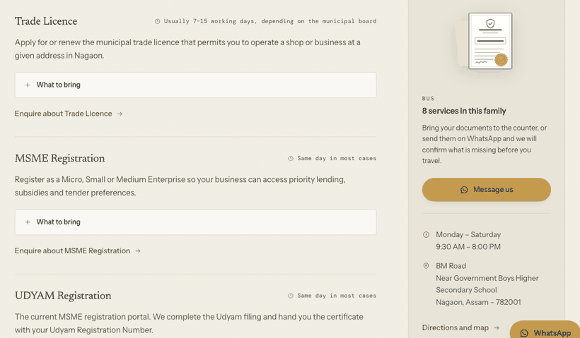
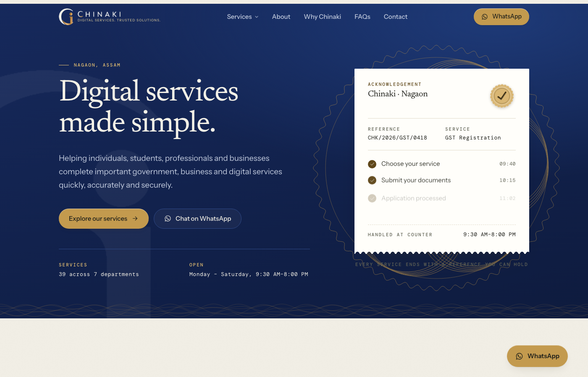

# Chinaki

Website for **Chinaki**, a digital service centre in Nagaon, Assam.
**Live at [www.chinaki.co.in](https://www.chinaki.co.in)**



*Every service says how long it usually takes and what to bring, so someone can tell whether they need it before travelling.*



Owned and operated by the business. Hosting and deployment run from the
owner's own accounts, deliberately separate from MSRX.

Next.js 15 (App Router) · React 19 · Tailwind v4 · TypeScript · fully static.

```bash
npm install
npm run dev     # http://localhost:3000
npm run build   # all routes prerendered
```

---

## Design direction — "The Seal and the Ledger"

Chinaki's product is a *completed, stamped application*, so the design is
built out of that object rather than out of stock-photo abstractions.

The brand's two colours already tell the business's story in the right
order. In Indian officialdom **navy** is the colour of a thing being in
process — the passport cover, the ledger ink, the departmental
letterhead. **Gold** is the colour of it being finished: the seal pressed
at the end. So navy is structural and gold is the metal, never the
reverse.

Every route opens on a navy masthead and closes on a navy footer, with
warm paper in between. The acknowledgement slip stays the signature by
being the whitest stock on the site and the only surface that casts a
real shadow — on navy it gains contrast rather than losing it.

| Axis | Decision | Why this and not the default |
| --- | --- | --- |
| Structure | **Navy** `#16295c` (12.0:1 on paper) | From the client's mark; the colour of Indian officialdom |
| Deepest field | `#0e1b3e` — mastheads, footer, plates | |
| Ground | Warm paper `#f1eee5` | Reads as stock, not as "white" |
| Ladder | raised `#f8f6ef` · sunk `#e8e4d8` · slip `#fffefa` | Real elevation, three steps |
| Gold as text | On navy, `#e0bc72` (9.3:1) | `#c89b4a` is only 4.3:1 on paper — never gold text there |
| Gold as text on paper | Deep muga `#7a5c26` (5.3:1) | |
| Gold as fill | `#c39a4e` with ink text (6.4:1) | The CTA keeps the brand without failing AA |
| Red | `#a5342b`, required-field and error states **only** | Never a brand or CTA colour |
| Display | **Newsreader** | Editorial and institutional; Playfair is the AI-default serif |
| Body | **Instrument Sans** | Slightly narrow, holds up at 15px on a mid-range Android |
| Utility | **DM Mono** | The machine voice: reference numbers, field labels |
| Wordmark | Letterspaced caps, `0.17em` | Title case reads as a different brand than the logo |
| Radius | 2–4px | Documents have square corners |
| Shadows | Tinted `rgba(58,48,24,…)` on paper | Black shadow on warm paper reads as dirt |
| Motion | `cubic-bezier(0.16, 1, 0.3, 1)`, CSS only | No Framer Motion — saves ~50 kB on a 4G audience |

### Ornament: generated guilloche, not stock photography

`src/components/Ornament.tsx`

The premium graphic language for this subject already exists and is
centuries old: **security engraving**. Guilloche rosettes, engine-turned
lathe work, milled coin edges, watermark seals — what is printed on
currency, share certificates and diplomas, precisely because it is
expensive and hard to forge.

Every graphic is generated from parametric curves into SVG paths:

- `Rosette` — spirograph interlace, `R·cos(t) + r·cos(k·t + φ)`, five
  phase-shifted copies. The hero one inks itself in on load like a plotter.
- `GuillocheBand` — two summed sine terms, phase-shifted into a ribbon.
  Sits on every navy-to-paper seam so the join reads as printed.
- `GhostMark` — the monogram at architectural scale, bled off two edges at
  watermark opacity.
- `Crest` — a milled medallion seating each service-family icon.
- `Filigree` — certificate corners, a rule that turns and ends in a rosette.

This buys unlimited ornament at near-zero weight (path data is long but
numerically repetitive, so it gzips hard) and keeps every graphic in one
family. **First load JS did not move: 106 kB, same as before the ornament
existed**, because it is all server-rendered SVG in the HTML.

No `Math.random` anywhere — the curves are deterministic, so they render
identically on server and client and never trip hydration.

### The signature: the Acknowledgement Slip

`src/components/AcknowledgementSlip.tsx`

A paper receipt torn along a perforation at its foot, lifted off the
desk, with a struck scalloped seal and the four stages ticking through in
order on load.

It does double duty: it is also the brief's four-step process, so the
page makes its promise and explains its method in one object instead of
two sections. It reappears once on `/why-chinaki` as evidence.

Two rejected iterations, kept here so they are not re-attempted:

- A circular gold disc with a thin tick read as a **clock face**. The
  scalloped rim is what makes a seal legible as a seal, so it is drawn
  in SVG (`Stamp` in `src/components/Logo.tsx`) rather than faked in CSS.
- Scallops on the **top** edge read as spiral notebook binding. A
  receipt tears at the foot.

The site shipped dark first (obsidian ground, alabaster documents), was
relit to daylight on 2026-07-30, then gained the navy masthead and the
guilloche programme on 2026-08-03 when the client's logo arrived. A light
theme is not an inversion and a re-brand is not a hue rotation: gold and
shadows both had to be rebuilt each time. See the token block in
`globals.css`.

---

## Architecture

```
src/
  app/
    layout.tsx              fonts, metadata, LocalBusiness JSON-LD, shell
    globals.css             the entire design system, one cascade
    page.tsx                homepage
    services/               hub + [category] (6 static params)
    about/ why-chinaki/ faqs/ contact/
    privacy-policy/ terms/
    sitemap.ts robots.ts opengraph-image.tsx icon.svg not-found.tsx
  components/
    Nav.tsx                 sticky glass bar, mega-menu, mobile sheet
    AcknowledgementSlip.tsx the signature
    Ornament.tsx            the guilloche engine — all generated graphics
    Logo.tsx                Mark (the client's monogram) + Stamp + lockup
    PageHeader.tsx          universal sub-page header — all 8 sub-pages
    EnquiryForm.tsx         floating labels, live validation
    EnquireBar.tsx          closing band on every sub-page
    Icons.tsx               hand-drawn set, no icon library
    Reveal.tsx              one IntersectionObserver for the document
  lib/
    site.ts                 every address, number and hour on the site
    services.ts             32 services / 6 families — single source of truth
```

**`lib/services.ts` drives** the mega-menu, mobile sheet, footer, hub
page, all six category pages, the A–Z index, the enquiry dropdown, the
sitemap and the `ItemList` schema. Add a service there and it appears
everywhere.

**`PageHeader`** is why eight sub-pages feel like one site: the title
size, breadcrumb and spacing are set in exactly one place.

---

## Things worth knowing before editing

**All CSS lives in `globals.css`, in cascade layers.** The base reset is
wrapped in `@layer base` deliberately. Unlayered CSS beats every layer
regardless of specificity — an unlayered `a { color: inherit }` silently
overrode `.btn-primary`, rendering cream-on-gold at 1.9:1. If you add
base styles, keep them in the layer.

**A `<select>` has no placeholder,** so `:not(:placeholder-shown)` is
always true for it and a floating label sits permanently lifted. The
value-based lift is scoped to `:is(input, textarea)`; the select uses
the `.is-lifted` class instead.

**Every colour pair is measured, not eyeballed, and measured against the
darkest surface it appears on** — `--color-sunk` for paper,
`--color-navy-deep` for navy, never the mid-tone. Every pair clears WCAG
AA 4.5:1, including the 11px mono labels. An earlier `--color-ink-faint`
passed on the ground at 4.67:1 and then failed on the sunk bands at
4.27:1. Re-check with the snippet in `docs/DEPLOY.md` if you change a
token.

**Ornament needs `max-width: none`.** The base reset clamps every `svg` to
100% of its container. That silently shrank the hero rosette to exactly the
slip's width, so the document covered the engraving and the signature
vanished — with no error anywhere. `.orn` sets `max-width: none` for this.

**The masthead's on-navy type rules carry a `:not(.slip-wrap *)`.** The
acknowledgement slip lives inside the navy masthead but is white paper, so
a blanket "everything on navy is light" washes its ink out to unreadable.
The exclusion is load-bearing, not tidiness.

**Reduced motion cancels the slip animation outright.** Zeroing
`animation-duration` is not enough — a delayed animation still holds its
`from` state, so the slip would land invisible.

**The enquiry form has no backend.** It composes a WhatsApp message and
hands it over, because WhatsApp is Chinaki's actual intake channel. The
button says "Send on WhatsApp" so it states what happens. Nothing is
stored on the site, which is what the privacy policy says.

---

## Content ownership

Real business details — address, `9706114332`, email, hours — are in
`src/lib/site.ts` only. The `geo` coordinates are Nagaon town centre and
should be replaced with the exact shop coordinates before launch, since
they feed the `LocalBusiness` schema and the map pack.

The reference numbers on the slip (`CHK/2026/GST/0418`) are illustrative
formatting, not real applications.

## Deployment

See `docs/DEPLOY.md`.
